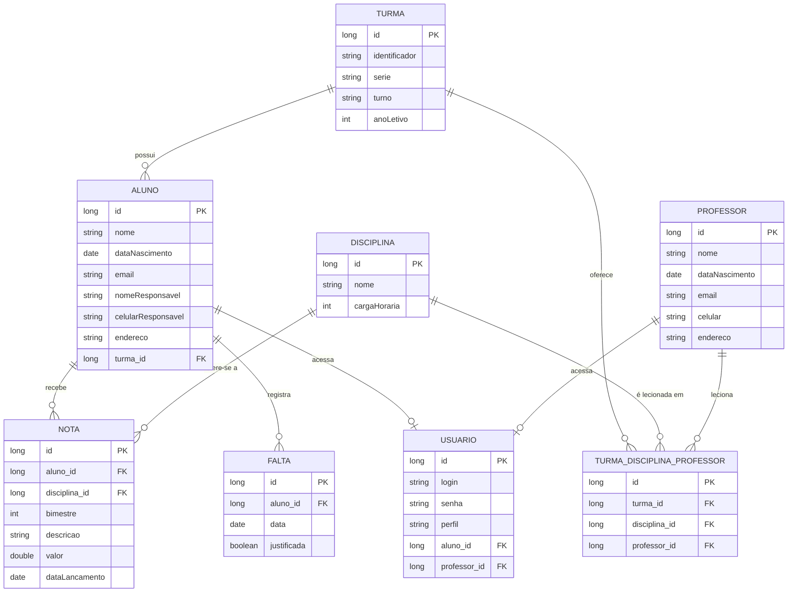

# 🏫 Sistema Escolar — Roadmap do Projeto

Projeto de estudo com **Java + Spring Boot + JPA/Hibernate + PostgreSQL**, desenvolvido em etapas incrementais, com commits progressivos documentando a evolução.

---

## 📌 Sobre o projeto

Sistema de gerenciamento escolar simples, com cadastro de alunos, professores, disciplinas, turmas e matrículas. Projeto criado para consolidar conceitos de JPA/Hibernate, arquitetura em camadas e boas práticas com Spring Boot.

---

## 🛠️ Tecnologias

- Java 17
- Spring Boot
- Spring Data JPA / Hibernate
- PostgreSQL
- Maven
- (futuramente) Spring Security, Bean Validation, Swagger

---

## 🗺️ Diagrama ER



> 💡 Esse bloco de código (` ```mermaid `) é renderizado automaticamente pelo GitHub quando colocado num arquivo `.md` — não precisa gerar imagem separada.

**Resumo das relações:**
- **Aluno** e **Professor** são entidades independentes (sem superclasse), cada uma com seus próprios campos: nome, data de nascimento, e-mail, celular e endereço (campo único de texto)
- No `Aluno`, os campos `nomeResponsavel` e `celularResponsavel` (não `celular`) representam sempre os dados do responsável, independente da idade do aluno. Já em `Professor`, o campo `celular` é o contato da própria pessoa
- Um **Aluno** pertence a **uma única Turma** (fixo, como no modelo brasileiro do infantil ao médio)
- Uma **Turma** tem vários **Alunos**
- Uma **Turma** pode ter **vários Professores**, cada um responsável por uma ou mais **Disciplinas** — isso é resolvido pela entidade associativa `TurmaDisciplinaProfessor`, que representa "esse professor leciona essa disciplina, nessa turma"
- **Nota** representa **cada avaliação individual** (ex: "Prova 1", "Trabalho em grupo") vinculada a `Aluno` + `Disciplina` + `bimestre`. A **média do bimestre não é armazenada** — ela é calculada em tempo real pelo `NotaService`, somando/tirando a média de todas as avaliações daquele aluno, disciplina e bimestre
- **Falta** é registrada **por dia inteiro** (não por disciplina/aula específica) — cada linha representa "esse aluno faltou nesse dia", com flag de `justificada`
- **Usuário** é a base para os perfis de acesso futuros (`ALUNO`, `PROFESSOR`, `DIRECAO`) — ele se relaciona opcionalmente com `Aluno` ou `Professor`, dependendo de quem está logando. Perfil `DIRECAO` não precisa vincular a nenhum dos dois, já que é acesso administrativo

**Por que uma entidade associativa (`TurmaDisciplinaProfessor`) em vez de relação direta?**
Porque no modelo a partir do 6º ano, uma turma tem vários professores (um de Matemática, outro de Português, etc). Se colocássemos `professor_id` direto na `Turma`, só daria pra guardar um professor por turma. Com a entidade associativa, cada linha representa "Professor X leciona Disciplina Y na Turma Z", permitindo N professores por turma e N disciplinas por professor.

---

## ✅ Roadmap de Desenvolvimento

### Etapa 1 — Setup do projeto
- [ ] Criar projeto Spring Boot (via Spring Initializr ou STS)
- [ ] Configurar `pom.xml` (Java 17, dependências: Web, JPA, PostgreSQL Driver)
- [ ] Configurar `application.properties` (conexão com banco)
- [ ] Criar banco de dados no PostgreSQL
- [ ] Subir projeto e validar conexão com o banco
- [ ] Primeiro commit: "chore: setup inicial do projeto"

### Etapa 2 — Camada de domínio (entidades)
- [ ] Criar entidade `Turma`
- [ ] Criar entidade `Aluno` (com `@ManyToOne` pra `Turma`)
- [ ] Criar entidade `Professor`
- [ ] Criar entidade `Disciplina`
- [ ] Criar entidade associativa `TurmaDisciplinaProfessor`
- [ ] Criar entidade `Nota`
- [ ] Criar entidade `Falta`
- [ ] Mapear relacionamentos (`@OneToMany`, `@ManyToOne`)
- [ ] Commit: "feat: criação das entidades do domínio"

### Etapa 3 — Camada de persistência
- [ ] Criar `TurmaRepository`
- [ ] Criar `AlunoRepository`
- [ ] Criar `ProfessorRepository`
- [ ] Criar `DisciplinaRepository`
- [ ] Criar `TurmaDisciplinaProfessorRepository`
- [ ] Criar `NotaRepository` (ex: buscar notas por aluno e bimestre)
- [ ] Criar `FaltaRepository` (ex: contar faltas por aluno e disciplina)
- [ ] Commit: "feat: repositórios JPA"

### Etapa 4 — Seed de dados de teste
- [ ] Criar classe de configuração (`CommandLineRunner`) para popular o banco
- [ ] Commit: "feat: dados de teste (seed)"

### Etapa 5 — Camada de serviço
- [ ] Criar `TurmaService`
- [ ] Criar `AlunoService` (regras de negócio + tratamento de exceções)
- [ ] Criar `ProfessorService`
- [ ] Criar `TurmaDisciplinaProfessorService` (ex: atribuir professor a uma turma/disciplina)
- [ ] Criar `NotaService` (ex: lançar avaliação, calcular média do aluno por disciplina/bimestre a partir de todas as avaliações)
- [ ] Criar `FaltaService` (ex: registrar falta por dia, calcular total/percentual de faltas por aluno)
- [ ] Criar exceções customizadas (`ResourceNotFoundException`, etc.)
- [ ] Commit: "feat: camada de serviço"

### Etapa 6 — Camada REST (Controllers)
- [ ] Criar `TurmaResource` com endpoints CRUD
- [ ] Criar `AlunoResource`
- [ ] Criar `ProfessorResource`
- [ ] Criar `NotaResource` (ex: lançar avaliação, listar avaliações do aluno, consultar média por bimestre)
- [ ] Criar `FaltaResource` (ex: registrar falta do dia, listar faltas por aluno, consultar total de faltas)
- [ ] Criar handler global de exceções (`@ControllerAdvice`)
- [ ] Testar endpoints via Postman/Insomnia
- [ ] Commit: "feat: endpoints REST"

### Etapa 7 — Melhorias e boas práticas
- [ ] Criar DTOs (separar entidade de payload de API)
- [ ] Validações com Bean Validation (`@NotBlank`, `@Email`, etc.)
- [ ] Documentar API com Swagger/OpenAPI
- [ ] Configurar CORS
- [ ] Commit: "feat: DTOs, validações e documentação da API"

### Etapa 8 — Deploy e documentação final
- [ ] Criar `README.md` completo (este roadmap pode virar parte dele)
- [ ] Adicionar instruções de execução local
- [ ] (Opcional) Deploy em serviço gratuito (Render, Railway, etc.)
- [ ] Commit: "docs: documentação final do projeto"

### Etapa 9 — Perfis de acesso (futuro)
- [ ] Criar entidade `Usuario` (login, senha, perfil)
- [ ] Definir enum `Perfil` (`ALUNO`, `PROFESSOR`, `DIRECAO`)
- [ ] Adicionar Spring Security ao projeto
- [ ] Implementar autenticação (login/token JWT)
- [ ] Restringir endpoints por perfil (ex: só `DIRECAO` pode criar `Turma`; só `PROFESSOR` pode lançar `Nota`; `ALUNO` só visualiza suas próprias notas/faltas)
- [ ] Commit: "feat: autenticação e autorização por perfil"

> 💡 Essa etapa foi deixada por último de propósito — segurança/autenticação costuma ser mais fácil de entender depois que o CRUD básico já está funcionando e testado.

---

## 🚀 Como rodar o projeto localmente

### Pré-requisitos
- Java 17 instalado
- Maven instalado (ou usar o wrapper `./mvnw`)
- PostgreSQL instalado e rodando

### Passo a passo

1. **Clone o repositório**
   ```bash
   git clone https://github.com/seu-usuario/sistema-escolar.git
   cd sistema-escolar
   ```

2. **Crie o banco de dados no PostgreSQL**
   ```sql
   CREATE DATABASE sistema_escolar;
   ```

3. **Configure as credenciais**

   Edite o arquivo `src/main/resources/application.properties` com seus dados de acesso:
   ```properties
   spring.datasource.url=jdbc:postgresql://localhost:5432/sistema_escolar
   spring.datasource.username=postgres
   spring.datasource.password=sua_senha

   spring.jpa.hibernate.ddl-auto=update
   spring.jpa.show-sql=true
   ```

4. **Execute o projeto**
   ```bash
   ./mvnw spring-boot:run
   ```

5. **Acesse a aplicação**

   A API estará disponível em:
   ```
   http://localhost:8080
   ```

   Endpoints disponíveis, por exemplo:
   ```
   GET  /alunos
   GET  /alunos/{id}
   POST /alunos
   ```

---

## 📄 Licença

Este projeto tem fins educacionais e está sob a licença MIT.
